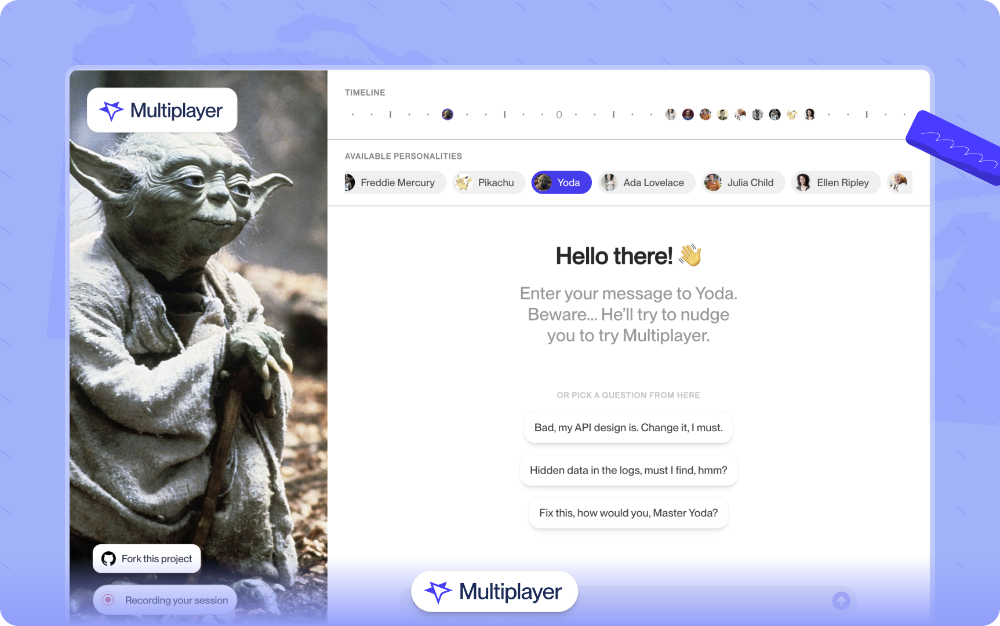

# AI Time Travel Chat Demo

This is a ⚠️ demo application ⚠️ showcasing how Multiplayer’s full-stack session recordings work, while you travel through time and chat with historical and fictional figures like Yoda and Pikachu, through an AI-driven dialogue.

During usage, you will encounter intentional errors that will prompt you to send a session recording to Multiplayer for analysis.

You can see a live version of this demo project here: [demo.multiplayer.app](https://demo.multiplayer.app)

## 🎥 About Multiplayer full-stack session recordings

Multiplayer collects, correlates, and enriches data from the full-stack in a single session-based recording, which includes: frontend screens, device and browser information, user comments, backend logs, correlated distributed traces, requests/responses and header content.

Full-stack session recordings are designed to aid developer workflows (fixing a bug, catching hard-to-reproduce failures, understanding a specific system behaviour, developing a new feature, identifying why a test failed, etc.). They can be used with the Multiplayer MCP server to stream session-based, full-stack, developer annotated recordings to your AI IDEs for more effective prompts.

Learn more at: [multiplayer.app](https://multiplayer.app)

## ✨ Key Features

- Time Travel Conversations - Chat with AI representations of historical and fictional figures from different eras
- Multiplayer Integration - Demonstrates real-time debugging and error reporting capabilities through full-stack session recordings.

## ⚡️ Quick Start

This demo requires Docker and Docker Compose to run locally.

1. Configure environment variables:
   `$ cp .env.example .env`.
   Then, edit the `.env` file to set your desired configuration options (e.g., API keys, service URLs).

2. Start the demo:
   `$ docker-compose up -d`

3. Access the application:
   Navigate to http://localhost:8080 to start exploring the time travel chat experience.

## 📚 API Endpoints

The demo includes several microservices, each accessible through documentation:
| Service | Endpoint | Description |
|---------|----------|-------------|
| Epoch Engine | /v1/epoch-engine/docs | Birth/death dates and biographical data for historical figures |
| Dialogue Hub | /v1/dialogue-hub/docs | AI chat interface for time travel conversations |
| Minds of Time | /v1/minds-of-time/docs | Database of prominent historical figures |
| Vault of Time | /v1/vault-of-time/docs | Historical events and timeline data |
| TimeGate | /v1/timegate/docs | API gateway and service orchestration |

## 🪲 Demo Usage

This demo is specifically designed to showcase Multiplayer’s full-stack session recordings.

1. The application starts recording a full-stack session replay as soon as you start your first chat.
2. After a few back and forth messages the application will show an intentional error message, prompting the user to review the full-stack session recording in the Multiplayer web UI (new browser tab).
3. The user can go back to continue chatting in the Time Travel demo app (or start new chats with other historical and fictional figures). The application will continue to stream new data to the original full-stack session recording.

## 📖 Demo Purpose

This application serves as a practical demonstration of:

- AI-powered conversational interfaces
- Historical data integration
- Multiplayer’s full-stack session recording capabilities
- Microservices architecture

Each API endpoint provides interactive documentation where you can test different features and observe how the system handles various scenarios.

## ⭐ Explore Further

Try different conversation scenarios, explore various historical periods, and experience how Multiplayer’s full-stack session replays enhance the development workflow. The intentional errors you encounter are designed to demonstrate the Multiplayer’s capabilities in real-world use cases.

## License

MIT — see [LICENSE](./LICENSE).
